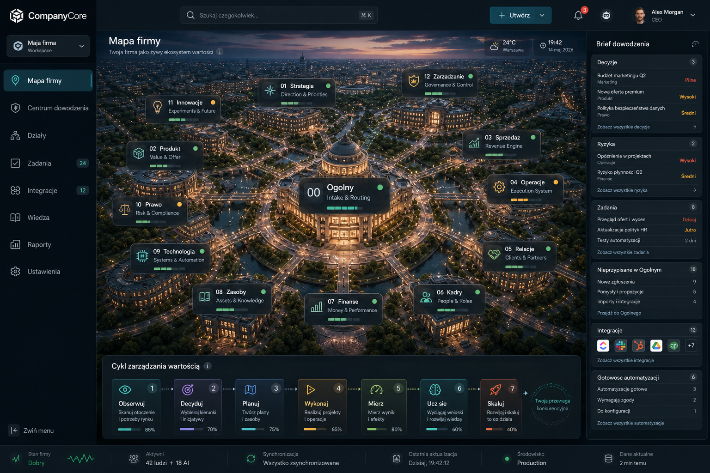
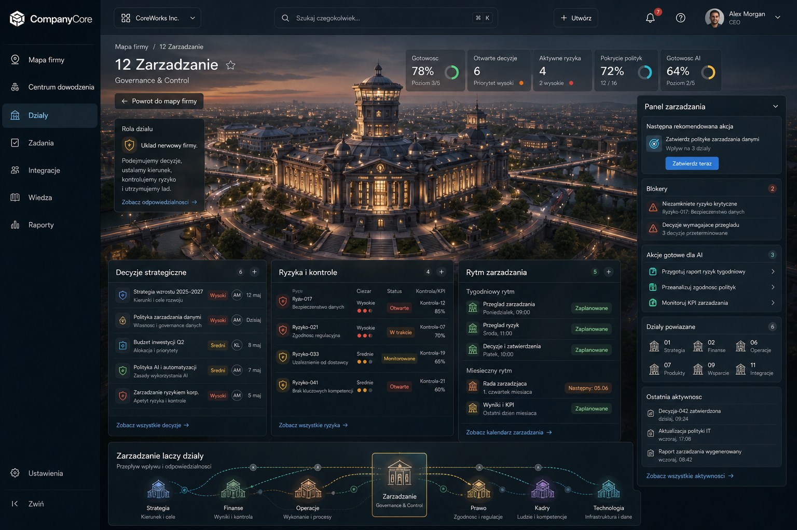

# Company City Dashboard V3 Spec

Last updated: 2026-05-14

## Purpose

This document is the canonical UX/UI target for the next CompanyCore dashboard
direction. It turns the approved Company City visual into an implementation
reference so future design and code work can avoid drift between generated
images, chat notes, and actual screens. V3 replaces the earlier sales/delivery
value-chain department model with the user's universal 13-area company model.

## Canonical Reference

- Current reference asset:
  `docs/ux/assets/company-city-dashboard-v3-target.png`
- Previous reference asset:
  `docs/ux/assets/company-city-dashboard-v2-target.png`
- Source type: approved generated visual target.
- Fidelity target for first implementation: structurally faithful with strong
  visual fidelity. Pixel-close work requires a later asset extraction and
  screenshot parity pass.
- Product metaphor: CompanyCore is a strategic company city where the user
  builds, understands, and steers value creation.
- Primary surfaces covered: web desktop, web tablet, web mobile, native mobile,
  and native tablet.

## Screen Contract

| Zone ID | Zone | Desktop Placement | Purpose | Must Stay Stable | Can Evolve |
| --- | --- | --- | --- | --- | --- |
| Z01 | App shell | Full viewport frame | Holds persistent navigation and authenticated product chrome. | Dark graphite shell, left navigation, top command bar, main content canvas. | Exact spacing and density per platform. |
| Z02 | Left sidebar | Fixed left rail | Primary navigation and workspace orientation. | Logo, workspace selector, active `Mapa firmy` item, core route list, settings/collapse at bottom. | Group labels, icon details, collapsed variant. |
| Z03 | Top command bar | Top of content area | Fast search, create, notifications, account. | Search, create action, notification state, user/account control. | Weather/time must not be required; keep bar quiet. |
| Z04 | City map canvas | Main central area | The primary mental model: company as a universal city/organization ecosystem. | Cinematic city/campus, `00 Ogolny` in center, 12 operating districts around it, connected roads/data rails. | Camera crop, city asset details, selected district. |
| Z05 | District markers | Overlay on map | Identify ownership areas and readiness. | Compact glass label, number/name, status dot, readiness/progress signal. | Exact marker position, hover details, icon or mini-meter style. |
| Z06 | Brief dowodzenia | Right panel | Shows what matters now, blockers, and direct action queues. | Sections: Decyzje, Ryzyka, Zadania, Nieprzypisane w Ogolnym, Integracje, Gotowosc automatyzacji. | Section order by route context, row counts, action affordances. |
| Z07 | Cykl zarzadzania wartoscia | Bottom overlay above status strip | Shows the universal operating loop and light progress layer. | Stages: Obserwuj, Decyduj, Planuj, Wykonaj, Mierz, Ucz sie, Skaluj. | Progress indicators, selected stage, condensed mobile presentation. |
| Z08 | Status strip | Bottom shell strip | Quiet operational state. | Workspace health, active people/actors, sync status, last update, environment, data timestamp. | Metrics included and density by platform. |

## Operating District Model

The dashboard must use exactly one central zero-area plus 12 operating
districts. Generated images may visually drift; implementation and future
concept prompts must use this table as the source of truth.

| Area ID | Label | Short Role | Map Hierarchy | Primary Objects | Example Signals |
| --- | --- | --- | --- | --- | --- |
| 00 | Ogolny | Intake & Routing | Central hub, largest district | Unassigned tasks, imports, ideas, support items, unknown ownership | Unassigned count, routing queue, stale intake |
| 01 | Strategia | Direction & Priorities | Direction district, high visibility | Strategy, goals, priorities, positioning, roadmap intent | Priority drift, strategic decisions |
| 02 | Produkt | Value & Offer | Value-definition district | Products, offers, value propositions, product scopes | Product readiness, offer clarity |
| 03 | Sprzedaz | Revenue Engine | Revenue district | Leads, deals, opportunities, sales tasks | Hot leads, follow-ups, conversion risk |
| 04 | Operacje | Execution System | Execution district | Processes, delivery flow, internal operations, capacity | Process blockers, delivery capacity |
| 05 | Relacje | Clients & Partners | Relationship district | Clients, partners, interactions, account health | Relationship health, follow-up risk |
| 06 | Kadry | People & Roles | People district | Team, roles, responsibilities, hiring, onboarding | Missing owners, people capacity |
| 07 | Finanse | Money & Performance | Financial control district | Budgets, invoices, revenue, costs, forecasts | Cash risk, budget review |
| 08 | Zasoby | Assets & Knowledge | Resource district | Assets, files, templates, knowledge roots, inventory | Missing resources, stale assets |
| 09 | Technologia | Systems & Automation | Technology district | Systems, data, APIs, integrations, automations | Sync health, technical readiness |
| 10 | Prawo | Risk & Compliance | Compliance district | Contracts, policies, legal risks, compliance checks | Policy gaps, review deadlines |
| 11 | Innowacje | Experiments & Future | Future district | Experiments, ideas, research, improvements | Experiment status, innovation bets |
| 12 | Zarzadzanie | Governance & Control | Governance district, high-elevation control point | Decisions, controls, reviews, policies, KPIs, risk oversight | Open decisions, risk controls, management cadence |

## Shared Component Inventory

| Component | Description | Reuse Scope | States | Responsive Notes |
| --- | --- | --- | --- | --- |
| `CompanyShell` | Authenticated frame with sidebar, topbar, content, and status strip. | All private routes. | signed out, loading, ready, error. | Mobile uses drawer/bottom nav; tablet can use compact rail. |
| `CompanySidebar` | Navigation and workspace entry. | All private routes. | expanded, collapsed, active item, unread/count badges. | Mobile becomes drawer or bottom navigation. |
| `TopCommandBar` | Search, create, notification, account controls. | All private routes. | idle, search focused, notification unread, account menu open. | Mobile should compress search behind command/search action. |
| `CompanyCityCanvas` | Cinematic city map container with overlays. | Dashboard, area overview, relationship/integration maps. | loading asset, ready, selected district, degraded asset fallback. | Mobile uses overview thumbnail plus district switcher. |
| `DistrictMarker` | Map overlay for each area. | Map-led surfaces. | healthy, review, blocked, selected, hover/focus. | Mobile marker labels become list rows or carousel cards. |
| `CommandBriefPanel` | Right contextual action summary, labeled `Brief dowodzenia` in Polish UI. | Dashboard and detail routes. | empty, loading, rows present, blocked/error. | Mobile appears before/after map depending on task urgency. |
| `OperatingCycleStrip` | Universal management/value operating loop. | Dashboard, onboarding, progress summaries. | stage complete, active, blocked, upcoming. | Mobile becomes horizontal scroll or stacked stepper. |
| `StatusStrip` | Quiet operational health footer. | Private shell. | healthy, syncing, degraded, stale data. | Mobile reduces to one-line health plus expandable details. |

## Layout Rules

| Surface | Primary Layout | Map Behavior | Command Brief Behavior | Operating Cycle Behavior |
| --- | --- | --- | --- | --- |
| Desktop web | Sidebar + topbar + full map + right panel + bottom strip. | Full cinematic canvas with all markers visible. | Persistent right panel. | Horizontal overlay above status strip. |
| Tablet web | Compact sidebar or rail + map + contextual panel. | Full or cropped map with selected district emphasis. | Side panel if space allows, otherwise stacked below/above map. | Condensed horizontal strip. |
| Mobile web | Action-first shell with map overview and district navigation. | Thumbnail/overview, selected district card, or carousel; avoid tiny full-map labels. | Priority command brief appears early. | Horizontal scroll stepper or compact progress summary. |
| Native mobile | Bottom navigation + focused district screens. | Overview layer for orientation, not primary dense workspace. | Native card/stack with local actions. | Compact progress route. |
| Native tablet | Split view with map and selected workbench. | Richer map with touch district selection. | Persistent or slide-over panel. | Horizontal or side rail depending orientation. |

## Interaction Rules

| Interaction | Expected Behavior | Notes |
| --- | --- | --- |
| Select district | Highlight district, update Command Brief, show district-specific tasks/signals. | `GENERAL` is default on first load when unassigned items exist. |
| Hover/focus marker | Show concise preview: readiness, blockers, primary next action. | Keyboard focus must expose same information. |
| Open district | Navigate to that area's workbench while preserving area context. | CRUD surfaces can be calmer than the map but keep district identity. |
| View unassigned GENERAL | Opens routing queue for owner/AI classification. | This is a core workflow, not a decorative notification. |
| Click operating cycle stage | Filters or explains related company objects by stage. | Stage progress must map to real evidence. |
| Integration badge/action | Opens integration map or provider setup. | Never expose raw provider errors directly. |

## Visual Rules

| Element | Visual Target | Avoid |
| --- | --- | --- |
| City asset | Realistic classic architecture, dusk atmosphere, warm lights, readable depth. | Generic gradients, abstract blobs, flat node graph, fantasy city. |
| UI chrome | Dark graphite glass, restrained borders, low blur, high text contrast. | Overly neon sci-fi, purple/blue one-note palette, giant rounded cards. |
| Markers | Compact glass labels with number, name, role, status dot, readiness meter. | Overlapping labels, random extra departments, unreadable microtext. |
| Gamification | Readiness, progress, unlocks, missions, health, value-flow milestones. | Fake points, streaks, arbitrary badges, reward loops disconnected from work. |
| Typography | Crisp operational labels, compact dashboard copy, no hero-scale text inside panels. | Long explanations, negative tracking, text that overflows controls. |

## Known Reference Corrections

The generated visual target is accepted for direction, but implementation must
use this corrected product structure:

- `Ogolny` is area `00`, not a normal department and not removable.
- The numbered departments are exactly `01` through `12` from the operating
  district table above.
- `Discovery`, `Marketing`, `CRM`, `Offer`, `Delivery`, `Support`, and
  `Automation` from V2 are no longer canonical departments. Their work can
  appear under the user's department model where appropriate.
- `Operacje` is a canonical department (`04`), not merely a command mode.
- `Zarzadzanie` is a canonical department (`12`) and owns governance/control
  work, not generic settings.
- Weather and time are optional atmosphere, not required product chrome.
- Any user-facing metric must come from real product state or be clearly
  absent until supported.

## Department Detail Target: 12 Zarzadzanie

- Current reference asset:
  `docs/ux/assets/company-city-management-department-v1-target.png`
- Role: governance and control workbench reached from the Company City map.
- Required header: `12 Zarzadzanie` with secondary role `Governance & Control`.
- Required sections: `Decyzje strategiczne`, `Ryzyka i kontrole`,
  `Rytm zarzadzania`, right-side `Panel zarzadzania`, and bottom relationship
  map `Zarzadzanie laczy dzialy`.
- Related departments shown in the relationship map: `Strategia`, `Finanse`,
  `Operacje`, `Prawo`, `Kadry`, `Technologia`.
- This view proves the drill-down pattern: cinematic district context at the
  top, real operational panels below, and a contextual right panel for next
  action, blockers, AI-ready actions, linked departments, and recent evidence.

## Future Work Checklist

- [ ] Create a detailed implementation task for the dashboard shell and map
      canvas.
- [ ] Define whether the first coded version uses a generated raster city map,
      layered SVG overlays, or a hybrid canvas/SVG overlay.
- [ ] Extract design tokens from this visual target before coding.
- [ ] Define mobile and tablet wireframes before implementing responsive
      behavior.
- [ ] Run screenshot comparison against this reference when implementation
      starts.
